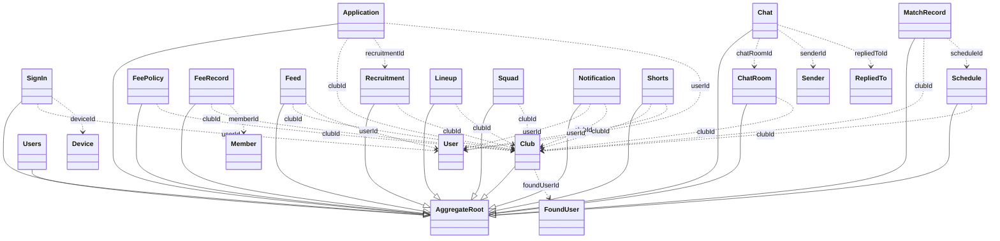

# Aggregate Overview

> Auto-generated from codebase. Do not edit manually.
> Run: `bash .claude/scripts/generate-domain-docs.sh`

```mermaid
classDiagram
    SignIn --|> AggregateRoot
    Chat --|> AggregateRoot
    ChatRoom --|> AggregateRoot
    Club --|> AggregateRoot
    FeePolicy --|> AggregateRoot
    FeeRecord --|> AggregateRoot
    Feed --|> AggregateRoot
    Application --|> AggregateRoot
    Recruitment --|> AggregateRoot
    Schedule --|> AggregateRoot
    Lineup --|> AggregateRoot
    Squad --|> AggregateRoot
    MatchRecord --|> AggregateRoot
    Notification --|> AggregateRoot
    Shorts --|> AggregateRoot
    Users --|> AggregateRoot
    SignIn ..> User : userId
    SignIn ..> Device : deviceId
    Chat ..> ChatRoom : chatRoomId
    Chat ..> Sender : senderId
    Chat ..> RepliedTo : repliedToId
    ChatRoom ..> Club : clubId
    Club ..> FoundUser : foundUserId
    FeePolicy ..> Club : clubId
    FeeRecord ..> Club : clubId
    FeeRecord ..> Member : memberId
    Feed ..> Club : clubId
    Feed ..> User : userId
    Application ..> Club : clubId
    Application ..> Recruitment : recruitmentId
    Application ..> User : userId
    Recruitment ..> Club : clubId
    Schedule ..> Club : clubId
    Lineup ..> Club : clubId
    Squad ..> Club : clubId
    MatchRecord ..> Club : clubId
    MatchRecord ..> Schedule : scheduleId
    Notification ..> User : userId
    Notification ..> Club : clubId
    Shorts ..> Club : clubId
    Shorts ..> User : userId
```
