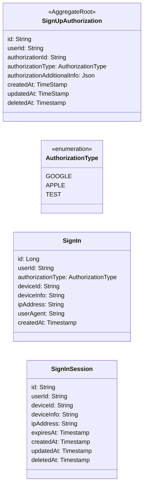

# 인증 모델

## 인증

```mermaid
classDiagram
    direction LR

    class SignUpAuthorization {
        <<AggregateRoot>>
        id: String
        userId: String
        authorizationId: String
        authorizationType: AuthorizationType
        authorizationAdditionalInfo: Json
        createdAt: TimeStamp
        updatedAt: TimeStamp
        deletedAt: Timestamp
    }

    class AuthorizationType {
        <<enumeration>>
        GOOGLE
        APPLE
        TEST
    }

    class SignIn {
        id: Long
        userId: String
        authorizationType: AuthorizationType
        deviceId: String
        deviceInfo: String
        ipAddress: String
        userAgent: String
        createdAt: Timestamp
    }

    class SignInSession {
        id: String
        userId: String
        deviceId: String 
        deviceInfo: String 
        ipAddress: String 
        expiresAt: Timestamp
        createdAt: Timestamp
        updatedAt: Timestamp
        deletedAt: Timestamp
    }
```
